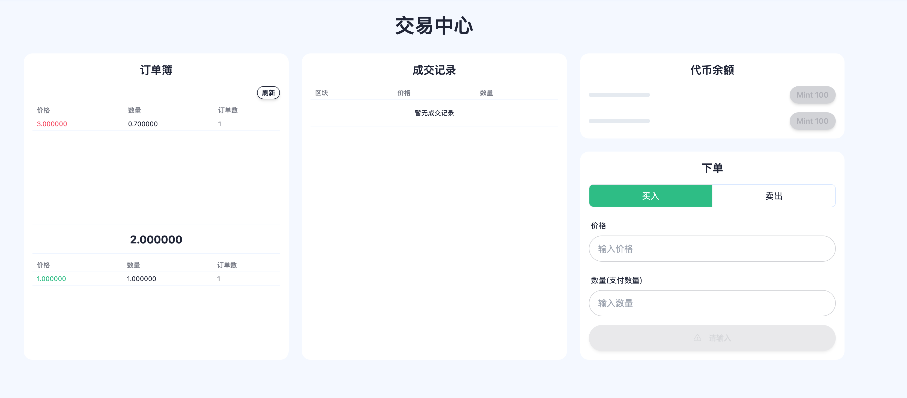

# Monad-CLOB

本仓库是一个用于展示如何在Monad上构建一个CLOB交易所的Workshop，感谢加戈提供的链式交易订单思路。

本仓库代码不能用于生产用途，因为代码没有做任何审计。

本仓库纯粹用于演示用途，作者：@BoxMrChen。

## 介绍
Monad-CLOB是一个小型的，实现了最基础功能的纯链上OrderBook系统，无需链下撮合系统辅助来完成订单的挂单，撮合等行为。

Monad-CLOB的参考了一些有趣的项目，并且从PVP Market中学到了链式订单这种有趣的思想，同时为了让workshop尽可能的简单，我们只实现了最简单的挂单和撮合能力。

同时代码中并不会展现严肃且高效的能力，因为在Monad上你不需要为了实现功能而且考虑如何精简代码。所以所有代码只为了完成功能而实现，同时为了代码简单易懂，代码会尽可能将功能清晰的展现。

同时，代码中已经存在一些已知问题，但是这不是目前我们需要考虑的重点，这些问题各位开发者可以尝试修复一下。

Monad-CLOB的大概原理如下：

1. 通过创建两个链式结构，将订单按照顺序排序，比如如果是bid的订单，就是从高到底，如果是ask则是从低到高，token0将会是基础Token，token1则是兑换token。
2. 当用户进行挂单的时候，会进行逻辑判断：
   - 如果说挂单时候的价格没有达到触发对手价格成交时，则直接进行挂单。
   - 如果说挂单价格达到了对手价格，则会先进行撮合。当撮合结束时，如果还有订单没有成交，则会进行挂单。
3. 成交订单的时候，会从链表头开始往后查询订单，并且成交所有符合的订单。当一个订单成交后，链表会将上一个节点的next修改成下一个订单，跳过当前已经成交完的订单，来达成订单删除的效果。

为了保证代码简单，我们使用 scaffoldeth2 构建代码，因为这套系统可以轻易的让我们实现一个代码原型，并且不需要考虑合约和前端的交互的方式，你可以认为他就是一个类似nextjs的框架。

## 实现后端代码

让我们打开 `packages/foundry/contracts/CLOB.sol` 文件，让我们开始编写合约代码。你可以看到文件内容为：

```solidity
// SPDX-License-Identifier: MIT
pragma solidity ^0.8.26;

interface IERC20 {
    function transferFrom(address from, address to, uint256 amount) external returns (bool);
    function transfer(address to, uint256 amount) external returns (bool);
    function balanceOf(address account) external view returns (uint256);
}

contract CLOB {
}
```

这个IERC20是我们ERC20合约的接口定义，当我们知道一个ERC20合约地址，就可以通过将类型设定为IERC20，并且调用对应的合约函数或者变量。

我们首先定义一些需要的内容

```solidity
error InvalidPriceOrAmount();//0x88f12bba
error TransferFailed(); //0x90b8ec18
error NotOrderOwner(); //0xf6412b5a
error OrderNotFoundOrCancelled();//0x01a5bd33
error TransferToSellerFailed();//0x35d2079c
error TransferToBuyerFailed();//0xb24b704a

contract CLOB{
    // 订单结构
    struct Order {
        address owner; // 订单所有者
        uint256 price; // 订单价格
        uint256 amount; // 订单数量
        uint128 next; // 下一个订单的ID
        bool isBid; // 是否为买单
    }

    // 订单簿
    mapping(uint128 => Order) public orders;
    uint128 public orderCount;

    // 买单和卖单的头指针（使用 uint128 存储）
    uint128 public bidHead;
    uint128 public askHead;

    // 代币合约
    IERC20 public immutable token0;
    IERC20 public immutable token1;

    // 事件
    event OrderPlaced(uint128 orderId, address owner, uint256 price, uint256 amount, bool isBid);
    event OrderMatched(uint128 orderId1, uint128 orderId2, uint256 price, uint256 amount);
    event OrderCancelled(uint128 orderId);
```

在上面，我们设定了一些预设error。并且定义了我们最重要的链表节点的结构，实际上来说这个结构并不是最优解，因为在solidity中，结构体中的成员如果能只占用256位，那么访问结构体就只需要一次读取，很明显这个定义是做不到的，不过正如我们一开始所说，优化不是我们的重点。

这个结构体中最为关键的成员就是那个 `next` ，他是我们实现链表的关键，我相信学过CS的对此应该非常熟悉，我不再过多解释。

`orders` 则是存储所有订单的map，而·orderCount·则是统计当前订单的数量，用于给新的订单设定唯一id。

·bidHead·和·askHead·则是我们的链表头，·token0·和·token1·则是我们需要交易的token和基础token。

然后我们定义了几个event，这几个其实非常重要，因为前端需要监听这些event来做数据更新。

然后我们补充一下我们的构造函数
```solidity
    event OrderCancelled(uint128 orderId);

    constructor(address _token0, address _token1) {
        // 确保 token0 的地址小于 token1
        token0 = IERC20(_token0);
        token1 = IERC20(_token1);
    }
```

构造函数中设定了两个·token·的地址，注意·token0·是基础代币地址，我们买卖都是基于·token0·的价格来计算的。

### 挂单函数

接下来实现挂单逻辑

···solidity
        token1 = IERC20(_token1);
    }

    function placeOrder(uint256 price, uint256 amount, bool isBid) external {
        if (!(price > 0 && amount > 0)) revert InvalidPriceOrAmount();

        // 确定需要转移的代币（买单使用token0，卖单使用token1）
        IERC20 tokenToLock = isBid ? token0 : token1;
        if (!tokenToLock.transferFrom(msg.sender, address(this), amount)) revert TransferFailed();

        _placeOrder(price, amount, isBid);
    }

    function _placeOrder(uint256 price, uint256 amount, bool isBid) internal {
        uint256 remainingAmount = amount;

        // 尝试撮合现有订单
        remainingAmount = _matchOrders(price, remainingAmount, isBid);

        // 如果还有剩余数量，创建新订单
        if (remainingAmount > 0) {
            _createOrder(price, remainingAmount, isBid);
        }
    }
···

这里我们创建了两个函数，当然你也可以合成一个，只不过我喜欢把检测逻辑放在一个单独的函数，这样方便做功能拓展。

仔细看 `_placeOrder` 其中做到的是我们一开始设定好的逻辑，先尝试撮合订单，然后如果还有剩余就创建新的订单。

接下来，我们实现撮合订单的函数，也就是·_matchOrders·。

### 撮合订单
实现撮合订单我们要实现核心的几个逻辑。
- 判断我们的是ask还是bid，在撮合的时候，我们只会从对手那边找订单，所以当我们是ask的订单，我们就会从bidHead中去获取订单。
- 需要注意的是，bid的订单链肯定是从价格大到小的，ask的订单则相反，所以我们在判断撮合进行循环的时候，价格要根据不同链的排序方式来选择对比方式。
- 同样的，如果说是bid的订单，我们要根据价格计算一下，才能知道我们需要支付多少数量。比如有一个订单挂单金额为 3，出售数量 1，那么在对手方，他需要支付 3个token1才能购买。

```solidity
    }

    // 通用撮合函数，处理买单和卖单
    function _matchOrders(uint256 price, uint256 amount, bool isBid) internal returns (uint256) {
        // 基于订单类型确定要匹配的链表头
        // 买单匹配卖单链表，卖单匹配买单链表
        uint128 currentOrderId = isBid ? askHead : bidHead;
        uint128 prevOrderId = 0;
        uint256 remainingAmount = amount;

        // 链表按价格排序: ask从低到高，bid从高到低
        while (currentOrderId != 0 && remainingAmount > 0) {
            Order storage matchOrder = orders[currentOrderId];

            // 检查价格匹配 - 利用链表的排序特性
            if (isBid) {
                // 买单匹配卖单：如果卖单价格高于买入价，停止匹配
                if (matchOrder.price > price) break;
            } else {
                // 卖单匹配买单：如果买单价格低于卖出价，停止匹配
                if (matchOrder.price < price) break;
            }

            // 计算可撮合数量
            uint256 matchAmountInOriginalUnit;
            if (isBid) {
                // 买单情况：计算能买到的token1数量
                // 买家给出的token0能买到多少token1
                uint256 buyableToken1 = (remainingAmount * 1e18) / matchOrder.price;
                // 匹配数量是实际可买到的token1与卖单提供的token1中的较小值
                matchAmountInOriginalUnit = _min(buyableToken1, matchOrder.amount);
            } else {
                // 卖单情况：计算能卖出的token1数量
                matchAmountInOriginalUnit = _min(remainingAmount, matchOrder.amount);
            }

            // 执行撮合
            if (isBid) {
                // 当前用户是买家（使用token0买token1），匹配的订单所有者是卖家
                _executeMatch(msg.sender, matchOrder.owner, matchAmountInOriginalUnit, matchOrder.price);
            } else {
                // 当前用户是卖家（使用token1卖token0），匹配的订单所有者是买家
                _executeMatch(matchOrder.owner, msg.sender, matchAmountInOriginalUnit, matchOrder.price);
            }

            // 更新剩余数量
            if (isBid) {
                // 买单情况：更新剩余的token0数量
                uint256 usedToken0 = (matchAmountInOriginalUnit * matchOrder.price) / 1e18;
                remainingAmount -= usedToken0;
            } else {
                // 卖单情况：更新剩余的token1数量
                remainingAmount -= matchAmountInOriginalUnit;
            }
            matchOrder.amount -= matchAmountInOriginalUnit;

            uint128 nextOrderId = matchOrder.next;

            // 如果订单完全成交，从链表中移除
            if (matchOrder.amount == 0) {
                _removeOrder(currentOrderId, prevOrderId, !isBid);
                // 移动到下一个订单
                currentOrderId = prevOrderId == 0 ? (isBid ? askHead : bidHead) : orders[prevOrderId].next;
            } else {
                // 移动到下一个订单
                prevOrderId = currentOrderId;
                currentOrderId = nextOrderId;
            }
        }

        return remainingAmount;
    }
```

简单讲解一下这个逻辑
- 首先是根据订单类型找到对应的链表头的ID
- 然后是根据订单价格判断是否满足撮合需求
- 然后计算一下订单可以成交的数量
- 进行撮合交易
- 判断剩余数量
- 判断当前被撮合的订单的剩余数量，如果不剩了就从链表中删除
- 然后继续撮合直到没有可以立刻成交的订单或者完全撮合完成。

我们可以看到其中多了函数·_executeMatch·和·_min·。

这个函数的主要目的是当订单成交时，将token转移到对应账户之中。实现也非常简单。至于min我就不多说了。
```solidity
    // 辅助函数：找出两个数中较小的一个
    function _min(uint256 a, uint256 b) internal pure returns (uint256) {
        return a < b ? a : b;
    }

    // 执行撮合交易
    function _executeMatch(address buyer, address seller, uint256 amount, uint256 price) internal {
        // 计算交易金额
        uint256 tokenAmount = amount;
        uint256 paymentAmount = (amount * price) / 1e18; // 假设价格精度为 18 位

        // 买家已经在placeOrder中锁定了token0，卖家已经锁定了token1
        // 将token1转给买家，将token0转给卖家
        if (!token1.transfer(buyer, tokenAmount)) revert TransferToBuyerFailed();
        if (!token0.transfer(seller, paymentAmount)) revert TransferToSellerFailed();

        emit OrderMatched(0, 0, price, amount);
    }
```
实际上就是将代币转移给订单创建人。不过这里实际上可以做成托管形式，因此独立成一个函数可以方便后续修改逻辑。

### 创建，取消订单
完成了撮合订单的部分，我们继续到最后一个部分的函数实现，创建订单。不过，既然有创建订单了，那我们也顺便把取消订单也实现了。
```solidity
    // 创建新订单
    function _createOrder(uint256 price, uint256 amount, bool isBid) internal {
        uint128 orderId = ++orderCount;
        orders[orderId] = Order({ owner: msg.sender, price: price, amount: amount, next: 0, isBid: isBid });

        // 插入订单到链表
        _insertOrder(orderId, isBid);

        emit OrderPlaced(orderId, msg.sender, price, amount, isBid);
    }

    // 从链表中移除订单
    function _removeOrder(uint128 orderId, uint128 prevId, bool isBid) internal {
        if (prevId == 0) {
            if (isBid) {
                bidHead = orders[orderId].next;
            } else {
                askHead = orders[orderId].next;
            }
        } else {
            orders[prevId].next = orders[orderId].next;
        }
    }

        // 取消订单
    function cancelOrder(uint128 orderId) external {
        if (orders[orderId].owner != msg.sender) revert NotOrderOwner();

        // 查找订单所在的链表
        bool isBid = orders[orderId].isBid;
        uint128 current = isBid ? bidHead : askHead;
        uint128 prev = 0;

        while (current != 0 && current != orderId) {
            prev = current;
            current = orders[current].next;
        }

        // 确保订单在链表中
        if (current != orderId) revert OrderNotFoundOrCancelled();

        // 从链表中移除订单
        _removeOrder(orderId, prev, isBid);

        // 返还资金
        IERC20 tokenToReturn = isBid ? token0 : token1;
        if (!tokenToReturn.transfer(msg.sender, orders[orderId].amount)) revert TransferFailed();

        emit OrderCancelled(orderId);
    }

    // 内部函数：插入订单到链表
    function _insertOrder(uint128 orderId, bool isBid) internal {
        uint128 current = isBid ? bidHead : askHead;
        uint128 prev = 0;

        // 找到合适的位置插入
        while (current != 0) {
            if (isBid) {
                if (orders[current].price < orders[orderId].price) break;
            } else {
                if (orders[current].price > orders[orderId].price) break;
            }
            prev = current;
            current = orders[current].next;
        }

        // 插入订单
        if (prev == 0) {
            if (isBid) {
                bidHead = orderId;
            } else {
                askHead = orderId;
            }
        } else {
            orders[prev].next = orderId;
        }
        orders[orderId].next = current;
    }
```

创建订单部分的逻辑比较简单，在·_insertOrder·函数中可以看到，插入订单的方式就是找一个价格合适的位置将订单插入到链表中。

### 查询辅助函数
这是这个合约最后需要添加的部分了，因为在前端，如果想要查询链上数据，就必须把每一个数据当成一个请求发送，如果你的数据在一个map里，你需要查询就需要一个一个的单独查询，这样很慢。

不过幸运的是，Solidity允许我们编写查询函数，用于给前端返回数据，这样我们只需要一个查询就可以获得大量数据。

因此我们添加几个辅助函数，作用是帮助前端快速的获取整个OrderBook。

```solidity
    // 获取最佳买卖价格
    function getBestBid() public view returns (uint256) {
        return bidHead != 0 ? orders[bidHead].price : 0;
    }

    function getBestAsk() public view returns (uint256) {
        return askHead != 0 ? orders[askHead].price : 0;
    }

    // 获取订单簿深度
    function getOrderBookDepth() public view returns (uint128 bidDepth, uint128 askDepth) {
        uint128 current = bidHead;
        while (current != 0) {
            bidDepth++;
            current = orders[current].next;
        }

        current = askHead;
        while (current != 0) {
            askDepth++;
            current = orders[current].next;
        }
    }

    // 获取完整订单簿
    struct OrderInfo {
        uint128 orderId;
        address owner;
        uint256 price;
        uint256 amount;
        bool isBid;
    }

    function getOrderBook() public view returns (OrderInfo[] memory bids, OrderInfo[] memory asks) {
        // 获取订单簿深度
        (uint128 bidDepth, uint128 askDepth) = getOrderBookDepth();
        
        // 创建结果数组
        bids = new OrderInfo[](bidDepth);
        asks = new OrderInfo[](askDepth);
        
        // 填充买单数组
        uint128 current = bidHead;
        uint128 index = 0;
        while (current != 0 && index < bidDepth) {
            Order storage order = orders[current];
            bids[index] = OrderInfo({
                orderId: current,
                owner: order.owner,
                price: order.price,
                amount: order.amount,
                isBid: true
            });
            current = order.next;
            index++;
        }
        
        // 填充卖单数组
        current = askHead;
        index = 0;
        while (current != 0 && index < askDepth) {
            Order storage order = orders[current];
            asks[index] = OrderInfo({
                orderId: current,
                owner: order.owner,
                price: order.price,
                amount: order.amount,
                isBid: false
            });
            current = order.next;
            index++;
        }
        
        return (bids, asks);
    }
```

其中，·getOrderBookDepth·是获取订单的深度，也就是当前有多少个活跃的订单。

而·getOrderBook·则是将ask和bid中所有的订单的获取出来，返回给前端。这两个辅助函数的逻辑并不复杂，可以稍微花时间看看。

### 完整代码
如果没有出现问题，你最后的代码应该是这样的。

```solidity
// SPDX-License-Identifier: MIT
pragma solidity ^0.8.26;

interface IERC20 {
    function transferFrom(address from, address to, uint256 amount) external returns (bool);
    function transfer(address to, uint256 amount) external returns (bool);
    function balanceOf(address account) external view returns (uint256);
}

error InvalidPriceOrAmount();//0x88f12bba
error TransferFailed(); //0x90b8ec18
error NotOrderOwner(); //0xf6412b5a
error OrderNotFoundOrCancelled();//0x01a5bd33
error TransferToSellerFailed();//0x35d2079c
error TransferToBuyerFailed();//0xb24b704a

contract CLOB {
    // 自定义错误

    // 订单结构
    struct Order {
        address owner; // 订单所有者
        uint256 price; // 订单价格
        uint256 amount; // 订单数量
        uint128 next; // 下一个订单的ID
        bool isBid; // 是否为买单
    }

    // 订单簿
    mapping(uint128 => Order) public orders;
    uint128 public orderCount;

    // 买单和卖单的头指针（使用 uint128 存储）
    uint128 public bidHead;
    uint128 public askHead;

    // 代币合约
    IERC20 public immutable token0;
    IERC20 public immutable token1;

    // 事件
    event OrderPlaced(uint128 orderId, address owner, uint256 price, uint256 amount, bool isBid);
    event OrderMatched(uint128 orderId1, uint128 orderId2, uint256 price, uint256 amount);
    event OrderCancelled(uint128 orderId);

    constructor(address _token0, address _token1) {
        // 确保 token0 的地址小于 token1
        token0 = IERC20(_token0);
        token1 = IERC20(_token1);
    }

    function placeOrder(uint256 price, uint256 amount, bool isBid) external {
        if (!(price > 0 && amount > 0)) revert InvalidPriceOrAmount();

        // 确定需要转移的代币（买单使用token0，卖单使用token1）
        IERC20 tokenToLock = isBid ? token0 : token1;
        if (!tokenToLock.transferFrom(msg.sender, address(this), amount)) revert TransferFailed();

        _placeOrder(price, amount, isBid);
    }

    function _placeOrder(uint256 price, uint256 amount, bool isBid) internal {
        uint256 remainingAmount = amount;

        // 尝试撮合现有订单
        remainingAmount = _matchOrders(price, remainingAmount, isBid);

        // 如果还有剩余数量，创建新订单
        if (remainingAmount > 0) {
            _createOrder(price, remainingAmount, isBid);
        }
    }

    // 通用撮合函数，处理买单和卖单
    function _matchOrders(uint256 price, uint256 amount, bool isBid) internal returns (uint256) {
        // 基于订单类型确定要匹配的链表头
        // 买单匹配卖单链表，卖单匹配买单链表
        uint128 currentOrderId = isBid ? askHead : bidHead;
        uint128 prevOrderId = 0;
        uint256 remainingAmount = amount;

        // 链表按价格排序: ask从低到高，bid从高到低
        while (currentOrderId != 0 && remainingAmount > 0) {
            Order storage matchOrder = orders[currentOrderId];

            // 检查价格匹配 - 利用链表的排序特性
            if (isBid) {
                // 买单匹配卖单：如果卖单价格高于买入价，停止匹配
                if (matchOrder.price > price) break;
            } else {
                // 卖单匹配买单：如果买单价格低于卖出价，停止匹配
                if (matchOrder.price < price) break;
            }

            // 计算可撮合数量
            uint256 matchAmountInOriginalUnit;
            if (isBid) {
                // 买单情况：计算能买到的token1数量
                // 买家给出的token0能买到多少token1
                uint256 buyableToken1 = (remainingAmount * 1e18) / matchOrder.price;
                // 匹配数量是实际可买到的token1与卖单提供的token1中的较小值
                matchAmountInOriginalUnit = _min(buyableToken1, matchOrder.amount);
            } else {
                // 卖单情况：计算能卖出的token1数量
                matchAmountInOriginalUnit = _min(remainingAmount, matchOrder.amount);
            }

            // 执行撮合
            if (isBid) {
                // 当前用户是买家（使用token0买token1），匹配的订单所有者是卖家
                _executeMatch(msg.sender, matchOrder.owner, matchAmountInOriginalUnit, matchOrder.price);
            } else {
                // 当前用户是卖家（使用token1卖token0），匹配的订单所有者是买家
                _executeMatch(matchOrder.owner, msg.sender, matchAmountInOriginalUnit, matchOrder.price);
            }

            // 更新剩余数量
            if (isBid) {
                // 买单情况：更新剩余的token0数量
                uint256 usedToken0 = (matchAmountInOriginalUnit * matchOrder.price) / 1e18;
                remainingAmount -= usedToken0;
            } else {
                // 卖单情况：更新剩余的token1数量
                remainingAmount -= matchAmountInOriginalUnit;
            }
            matchOrder.amount -= matchAmountInOriginalUnit;

            uint128 nextOrderId = matchOrder.next;

            // 如果订单完全成交，从链表中移除
            if (matchOrder.amount == 0) {
                _removeOrder(currentOrderId, prevOrderId, !isBid);
                // 移动到下一个订单
                currentOrderId = prevOrderId == 0 ? (isBid ? askHead : bidHead) : orders[prevOrderId].next;
            } else {
                // 移动到下一个订单
                prevOrderId = currentOrderId;
                currentOrderId = nextOrderId;
            }
        }

        return remainingAmount;
    }

    // 创建新订单
    function _createOrder(uint256 price, uint256 amount, bool isBid) internal {
        uint128 orderId = ++orderCount;
        orders[orderId] = Order({ owner: msg.sender, price: price, amount: amount, next: 0, isBid: isBid });

        // 插入订单到链表
        _insertOrder(orderId, isBid);

        emit OrderPlaced(orderId, msg.sender, price, amount, isBid);
    }

    // 从链表中移除订单
    function _removeOrder(uint128 orderId, uint128 prevId, bool isBid) internal {
        if (prevId == 0) {
            if (isBid) {
                bidHead = orders[orderId].next;
            } else {
                askHead = orders[orderId].next;
            }
        } else {
            orders[prevId].next = orders[orderId].next;
        }

        // 不需要将订单标记为inactive，因为它已经从链表中移除
    }

    // 辅助函数：找出两个数中较小的一个
    function _min(uint256 a, uint256 b) internal pure returns (uint256) {
        return a < b ? a : b;
    }

    // 执行撮合交易
    function _executeMatch(address buyer, address seller, uint256 amount, uint256 price) internal {
        // 计算交易金额
        uint256 tokenAmount = amount;
        uint256 paymentAmount = (amount * price) / 1e18; // 假设价格精度为 18 位

        // 买家已经在placeOrder中锁定了token0，卖家已经锁定了token1
        // 将token1转给买家，将token0转给卖家
        if (!token1.transfer(buyer, tokenAmount)) revert TransferToBuyerFailed();
        if (!token0.transfer(seller, paymentAmount)) revert TransferToSellerFailed();

        emit OrderMatched(0, 0, price, amount);
    }

    // 取消订单
    function cancelOrder(uint128 orderId) external {
        if (orders[orderId].owner != msg.sender) revert NotOrderOwner();

        // 查找订单所在的链表
        bool isBid = orders[orderId].isBid;
        uint128 current = isBid ? bidHead : askHead;
        uint128 prev = 0;

        while (current != 0 && current != orderId) {
            prev = current;
            current = orders[current].next;
        }

        // 确保订单在链表中
        if (current != orderId) revert OrderNotFoundOrCancelled();

        // 从链表中移除订单
        _removeOrder(orderId, prev, isBid);

        // 返还资金
        IERC20 tokenToReturn = isBid ? token0 : token1;
        if (!tokenToReturn.transfer(msg.sender, orders[orderId].amount)) revert TransferFailed();

        emit OrderCancelled(orderId);
    }

    // 内部函数：插入订单到链表
    function _insertOrder(uint128 orderId, bool isBid) internal {
        uint128 current = isBid ? bidHead : askHead;
        uint128 prev = 0;

        // 找到合适的位置插入
        while (current != 0) {
            if (isBid) {
                if (orders[current].price < orders[orderId].price) break;
            } else {
                if (orders[current].price > orders[orderId].price) break;
            }
            prev = current;
            current = orders[current].next;
        }

        // 插入订单
        if (prev == 0) {
            if (isBid) {
                bidHead = orderId;
            } else {
                askHead = orderId;
            }
        } else {
            orders[prev].next = orderId;
        }
        orders[orderId].next = current;
    }

    // 获取最佳买卖价格
    function getBestBid() public view returns (uint256) {
        return bidHead != 0 ? orders[bidHead].price : 0;
    }

    function getBestAsk() public view returns (uint256) {
        return askHead != 0 ? orders[askHead].price : 0;
    }

    // 获取订单簿深度
    function getOrderBookDepth() public view returns (uint128 bidDepth, uint128 askDepth) {
        uint128 current = bidHead;
        while (current != 0) {
            bidDepth++;
            current = orders[current].next;
        }

        current = askHead;
        while (current != 0) {
            askDepth++;
            current = orders[current].next;
        }
    }

    // 获取完整订单簿
    struct OrderInfo {
        uint128 orderId;
        address owner;
        uint256 price;
        uint256 amount;
        bool isBid;
    }

    function getOrderBook() public view returns (OrderInfo[] memory bids, OrderInfo[] memory asks) {
        // 获取订单簿深度
        (uint128 bidDepth, uint128 askDepth) = getOrderBookDepth();
        
        // 创建结果数组
        bids = new OrderInfo[](bidDepth);
        asks = new OrderInfo[](askDepth);
        
        // 填充买单数组
        uint128 current = bidHead;
        uint128 index = 0;
        while (current != 0 && index < bidDepth) {
            Order storage order = orders[current];
            bids[index] = OrderInfo({
                orderId: current,
                owner: order.owner,
                price: order.price,
                amount: order.amount,
                isBid: true
            });
            current = order.next;
            index++;
        }
        
        // 填充卖单数组
        current = askHead;
        index = 0;
        while (current != 0 && index < askDepth) {
            Order storage order = orders[current];
            asks[index] = OrderInfo({
                orderId: current,
                owner: order.owner,
                price: order.price,
                amount: order.amount,
                isBid: false
            });
            current = order.next;
            index++;
        }
        
        return (bids, asks);
    }
}
```


## 编写前端展示部分
接下来我们来编写前端部分的内容，在此说明一下，因为前端包含的不单单是读取逻辑，他还包含各种的UI组件和交互。因此我们不会从头开始构建一个前端内容，接下来的内容中，我会指引大家一步步的完成数据获取部分，至于UI部分则不是我们需要专注的点。



目前，我们有三个组件需要我们完善。
- 展示订单组件（获取链上数据）
- 展示成交的组件（获取Event数据）
- 发送交易组件 （写操作，发送交易到链上）

### 展示订单组件

这个组件的UI部分在`packages/nextjs/components/trade/OrderBook.tsx`，观察这里面的实现，我们可以发现。
```solidity
export const OrderBook = () => {
  const [, setSelectedPrice] = useAtom(selectedPriceAtom);
  const [, setTradeType] = useAtom(tradeTypeAtom);
  const { mergedAsks, mergedBids, isLoading, refetchOrderBook: refetch } = useOrderBook();
```

代码中使用了一个函数`useOrderBook`来获取所有的数据和刷新数据。

那么前端是如何做到自动刷新的呢？实际上这里是通过监听了链上CLOB合约的事件产生，当有事件产生的时候就会触发一次交易刷新的逻辑。正如下面这段代码展示的内容一样。

```solidity
const OrderBookEventListener = React.memo(function OrderBookEventListener({
  onOrdersChange,
}: {
  onOrdersChange: () => void;
}) {
  useScaffoldWatchContractEvent({
    contractName: "CLOB",
    onLogs: () => onOrdersChange(),
  });

  return null;
});
```

### 实现展示订单组件的数据获取逻辑
现在我们来实现一下`useOrderBook`这个hook函数。

进入文件 `packages/nextjs/hooks/trade/useOrderBook.ts`。

将原来的`useOrderBook`函数修改为以下内容。

```typescript
export const useOrderBook = () => {
  const [mergedAsks, setMergedAsks] = useState<MergedOrderType[]>([]);
  const [mergedBids, setMergedBids] = useState<MergedOrderType[]>([]);

  // 使用新添加的getOrderBook函数获取完整订单簿
  const {
    data: orderBookData,
    refetch: refetchOrderBook,
    isLoading,
  } = useScaffoldReadContract({
    contractName: "CLOB",
    functionName: "getOrderBook",
  });

  // 处理订单簿数据
  useEffect(() => {
    if (orderBookData) {
      try {
        const { sortedMergedAsks, sortedMergedBids } = handleOrderBookData(orderBookData);
        setMergedAsks(sortedMergedAsks);
        setMergedBids(sortedMergedBids);
      } catch (error) {
        console.error("Error processing order book data:", error);
      }
    }
  }, [orderBookData]);

  return { mergedAsks, mergedBids, isLoading, refetchOrderBook };
};
```

注意看我们的核心逻辑，这里使用了 `useScaffoldReadContract` 作为数据读取的方式，调用了CLOB合约中的`getOrderBook`函数，这就是我们刚刚创建的辅助函数。此时我们就轻松的获得了链上订单的数据。

`useScaffoldReadContract`这个函数是由`scaffoldeth2`框架提供，并且还提供给了我们各种状态和刷新函数，因此我们将其暴露即可轻松的和前端进行整合。

这部分的实现内容其实就是调用链上函数并且将数据处理后交给前端，是最为基础的前端和区块链交互的方式。

### 实现展示成交的组件
展示成交组件这一块的实现思路是通过监听链上的产生的 `OrderMatched` Event，然后将监听到的数据保存和展示。但是这里的逻辑有一个缺陷，就是我们无法获取过去的Event，因为我们是监听，而不是获取。所以如果页面关闭，我们之前获取的数据就没有了。所以一般来说，除了监听，还需要获取历史事件，但是为了代码简洁，我没有添加此部分的代码，感兴趣的朋友可以在后续事件中加上这部分的功能。也可以使用类似thegraph一样的indexer工具完善这部分功能。

我们进入 `packages/nextjs/hooks/trade/useTradeHistory.ts`文件。将`useTradeHistory`函数完善成下面的片段。

```typescript
export const useTradeHistory = () => {
  const [orderMatchedEvents, setOrderMatchedEvents] = useState<TradeRecord[]>([]);

  useScaffoldWatchContractEvent({
    contractName: "CLOB",
    eventName: "OrderMatched",
    onLogs: logs => {
      logs.forEach(log => {
        setOrderMatchedEvents(prevLogs => [
          {
            orderId1: Number(log.args.orderId1),
            orderId2: Number(log.args.orderId2),
            price: log.args.price,
            amount: log.args.amount,
            timestamp: Number(log.blockNumber || Date.now() / 1000),
            id: `${log.transactionHash}-${log.logIndex}`,
          },
          ...prevLogs,
        ]);
      });
    },
  });

  return { orderMatchedEvents };
};
```

这个Hook中核心逻辑为 `useScaffoldWatchContractEvent` ，这个函数的作用是监听链上的事件发生，当有事件产生的时候，会调用onLogs成员，注意，传入的logs是一个数组，因为他的监听是按照block为单位，因此每次监听基本上都是一个block中的目标事件。我们在处理函数中对事件进行处理，并且转换成我们需要的结果。此时我们就完成了监听链上消息变化的功能。

### 实现发送交易组件

发送交易组件位于 `packages/nextjs/components/trade/TradeForm.tsx`，将下面的代码替换掉 `// TODO: 实现发送交易组件`

```typescript
  // CLOB合约下单
  const { writeContractAsync: placeClobOrder, isPending: isPlacingOrder } = useScaffoldWriteContract({
    contractName: "CLOB",
  });

  // 提交订单
  const handleSubmitOrder = async () => {
    if (!price || !amount || !connectedAddress) return;

    try {
      setSubmitting(true);

      // 下单
      await placeClobOrder({
        functionName: "placeOrder",
        args: [parseEther(price), parseEther(amount), tradeType === "buy" ? true : false],
      });

      // 重置表单
      setAmount("");
      setPrice("");
    } catch (error) {
      console.error("Order submission error:", error);
    } finally {
      setSubmitting(false);
    }
  };
```

这段代码展现的是往区块链上发送交易的能力，首先我们使用 `useScaffoldWriteContract` 函数，获取我们的合约，然后，创建一个临时函数 `handleSubmitOrder`, 这个函数是在下单按钮被点击时触发，函数中，我们通过调用链上合约中的`placeOrder`函数，并且根据内容传入参数，以达到往区块链上发送交易的目的。

此时，我们就完成了前端中三个最重要的组件的开发。

